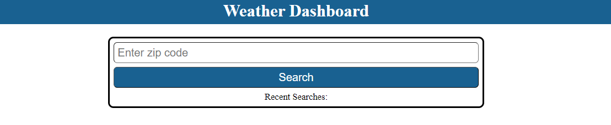
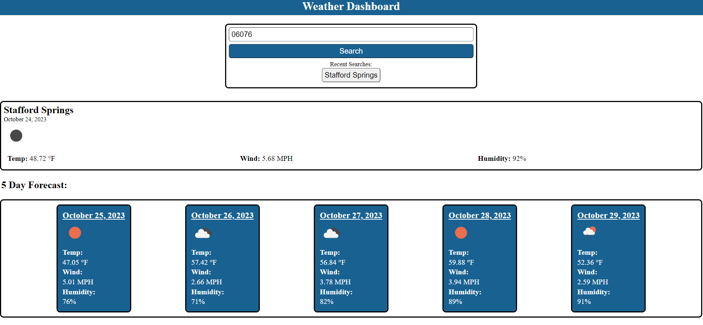

# Weather App

Welcome to the Weather Dashboard! Click [here](https://dakotablanchard.github.io/weather-app/) to launch the app!

The purpose of this web application is to be able to search for a city and see current and future weather.

## How to use:

* On first open, you will see this main homescreen. 

* Simply type in the zip code of the city you would like to search for and click the search button.

* Once you have clicked search, the dashboard will load showing you current weather conditions, as well as a 5 day forecast.

* Anytime you search for a city, it will appear under the search bar as a recent search.

* If you wish to reload weather for a city you've previously searched, simply click the name of the city under "Recent Searches"

## Tools used:

[DayJS](https://day.js.org/)

[OpenWeather Api](https://openweathermap.org/api)

Additional Credits/Resources:

[How to log multiple days with DayJS](https://github.com/cypress-io/cypress-example-recipes/issues/704)

[Centering a div in CSS](https://blog.hubspot.com/website/center-div-css#:~:text=While%20there%20are%20several%20different,vertical%20center%20of%20the%20page.)